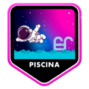

## Hi there! Welcome to my GitHub! 👋

My name is Melissa, and I am a student at **42 São Paulo**, a programming school that emphasizes peer-to-peer learning and problem-solving.

💻 This space is dedicated to sharing the projects I’ve developed, ranging from academic challenges at 42 to personal experiments that demonstrate my interest in technology and learning.

Feel free to explore and follow my journey!

  

## I'm currently learning

## Completed projects at 42SP

## Contact me

